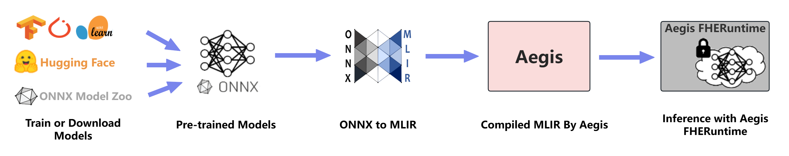

# Aegis

## Overview

Aegis is an open-source framework based on MLIR that simplifies the use of Fully Homomorphic Encryption (FHE).

Aegis provides developer-friendly FHE compiler and runtime environment toolkit, with high-performance cryptography algorithms integration, easy to use APIs, aautomated tuning, and one-click deployment. Aegis supports various AI applications like NLP, CV, and even LLMs. It enables the reuse of these AI models, allowing code to be converted into a privacy-preserving form with minimal changes.

## Installation

### Prerequisites

#### Ubuntu

```shell
sudo apt update
sudo apt install clang
sudo apt install python3
sudo apt install python3-pip
sudo pip install build 
sudo pip install torch          
sudo pip install tensorflow     # (Optional)
sudo pip install scikit-learn   # (Optional)
```

#### CentOS

```shell
sudo yum update
sudo yum install clang
sudo yum install python3
sudo yum install python3-pip
sudo pip install build
sudo pip install torch          
sudo pip install tensorflow     # (Optional)
sudo pip install scikit-learn   # (Optional)
```

> python version 3.10 or above (which can be checked by running python --version).

### MacOS(Arm64)

```shell
brew install ninja
brew install lld clang
brew install python3
brew install protobuf
pip3 install build
pip3 install onnx
brew install libomp
```

### Installation

#### Using Pip

Aegis offers out-of-the-box functionality, allowing you to get started quickly with a simple `python pip` installation.

Install Aegis using the following commands:

```shell
git clone https://github.com/primus-labs/Aegis.git
cd Aegis
./scripts/build_wheel.sh
pip install ./frontend/dist/primus-0.1.0-py3-none-any.whl
```

#### Using Docker

Aegis will offer Docker images in the future, which you can obtain and use with the following commands:

```shell
docker pull primus/aegis:v0.1.0
docker run --rm -it primus/aegis /bin/bash
```

## How Aegis Works



Aegis accepts pre-trained machine learning ONNX models as input, converts them to MLIR using the ONNX-MLIR integrated into the Aegis frontend, and then compiles the MLIR into a fully homomorphic encryption (FHE) program using Aegis. The program is executed through Aegis FHERuntime. This process enables Aegis to support pre-trained machine learning models that have been trained and fine-tuned using popular machine learning frameworks, such as PyTorch, TensorFlow, Scikit-learn, and more.

## Getting Started

To compute on encrypted data, first define your target function or load an ONNX model, then compile it to target homomorphic binaries, and finally execute the binary evaluation.
Here is the full examples:

- ONNX model sample​
  ```python
    from primus.aegis.fheruntime import LocalFHEInferenceSession as LocalInferenceSession
    from typing import List
    import numpy as np

    data_1 = np.array([1, 3, 5, 7, 9, 11], dtype = np.float32)
    data_2 = np.array([2, 4, 6, 8, 10, 12], dtype = np.float32)

    inference_session = LocalInferenceSession(path_or_bytes = "/path/to/add.onnx")
    output = inference_session.encrypt_run_decrypt(['Y'], {'X1': data_1, 'X2': data_2})
    print(output)
  ```

- ​​Target function sample​(TODO)
  ```python
    from primus.aegis.fheruntime import FHEServer as Server, FHEClient as Client 
    import numpy as np

    def add_1d_6elements(X1: list[float, 6], X2: list[float, 6]) -> list[float, 6]:
        for i in range(6):
            X1[i] = X1[i] + X2[i]
        return X1

    # compile the target function
    server = Server()
    compile_result = server.compile(py_function = add_1d_6elements)

    # key gen
    client = Client()
    client.keygen(compile_result.prog_spec_path)
    client.dump_pub_keys(pub_keys_path)

    # encrypte
    private_data_1 = np.array([1, 3, 5, 7, 9, 11])
    private_data_2 = np.array([2, 4, 6, 8, 10, 12])
    enc_val1, enc_val2 = client.encrypt([private_data_1, private_data_2], True)

    # run
    server.load_pub_keys(pub_keys_path)
    enc_output = server.run([enc_val1, enc_val2], compile_result)

    # decrypte
    output = client.decrypt(enc_output)
    print(output)
  ```

## Resources
- [Core Architecture](https://fhe.primuslabs.xyz/docs/Installation/core_architecture)
- [Compilation Workflow](https://fhe.primuslabs.xyz/docs/Installation/compile_workflow)

## Contributing
Aegis is an open source project developed under the Apache-2.0 license and maintained by [Primus Labs](https://www.primuslabs.xyz/). Contributions from individuals and organizations are all welcome. Before beginning, please take a look at our [contributing guidelines](CONTRIBUTING.md). Our project adheres to [code of conduct](CODE_OF_CONDUCT.md). By participating in our community, you are expected to uphold this code. 

## License
[Apache License 2.0](LICENSE)