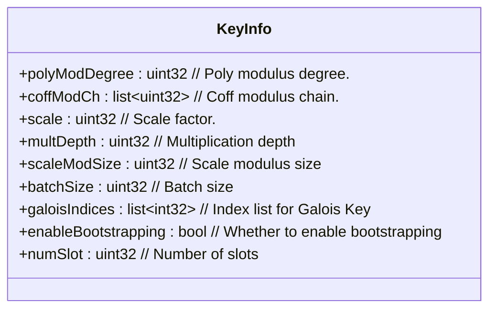
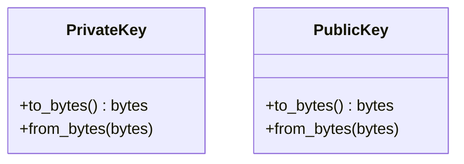
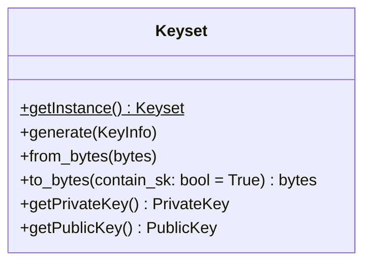
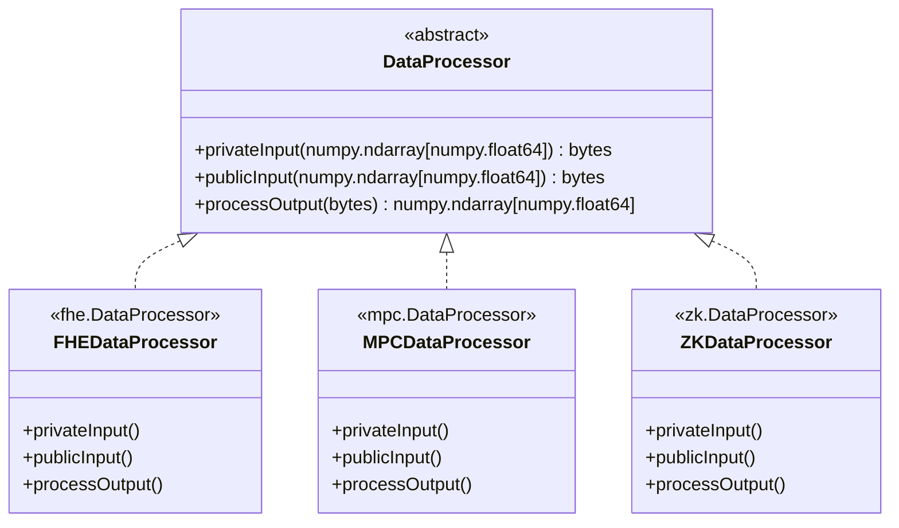
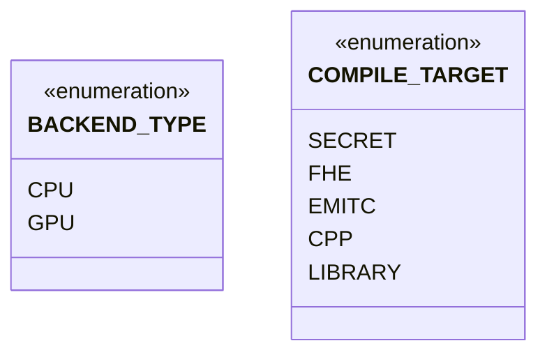
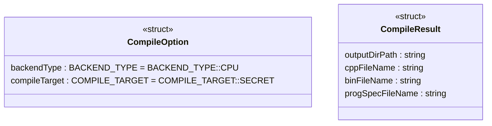
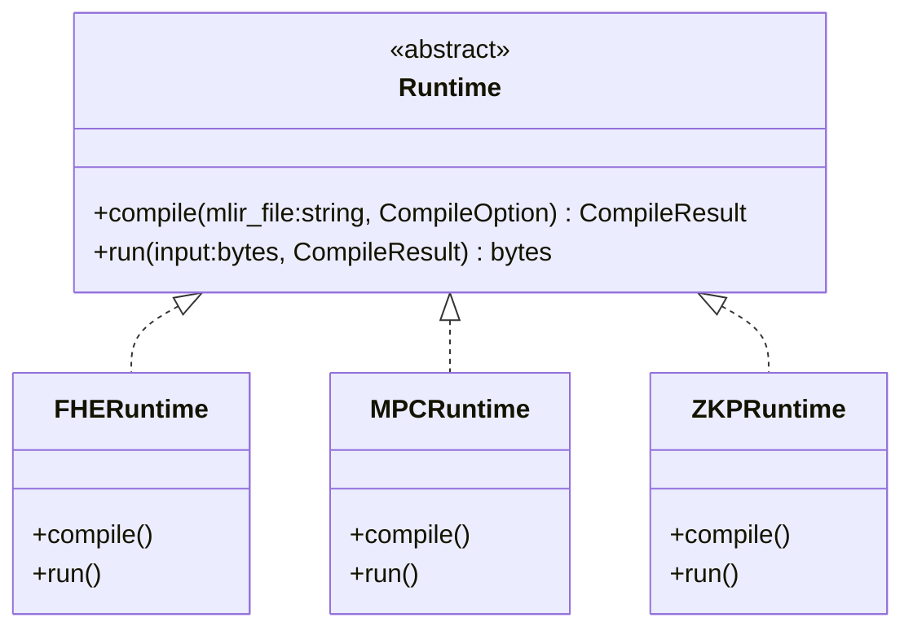

- [Overview](#overview)
- [FHE](#fhe)
  - [Simple Usage](#simple-usage)
- [DataProcessor](#dataprocessor)
  - [Simple Usage](#simple-usage-1)
- [Runtime](#runtime)
  - [Simple Usage](#simple-usage-2)


## Overview

- The module name is `primus_aegis`.
- The default backend is CPU. (Maybe add .gpu for GPU backend, such as` primus_aegis.gpu.XXX`.)
- The source folder is `./midend/lib/Binding`.
- The way how to import the module:
  ```py
  import primus_aegis
  ```

<br/>

Basic flow:
- Run `onnx-mlir` to compile the `onnx-model` to generate the `model.mlir` file.
- Call `Runtime.compile(model.mlir)` to generate the `program_spec.json` file.
- Construct a `KeyInfo` and call `FHEKeyset.generate()` to generate the FHE keys and context.
- Call `Runtime.run(input)` and so on.


## FHE

Namespace: `primus_aegis.fhe`.

**KeyInfo**



The fields' value in the KeyInfo structure come from the `program_sepc.json` file generated by `Runtime.compile()`.


**Keys**



Some keys related to FHE.

**Keyset**




- Use `.getInstance()` to get the instance of Keyset.
- Use `.generate()` to generate a set of keys (and context) by passing in the `KeyInfo` object.
- Use `.get***Key()` to get the corresponding key.
- Use `.to_bytes()` to save all the keys to a string, and then use `.from_bytes()` to load the saved keys. Only publicly available information will be exported if set `contain_sk` to `False`.


### Simple Usage

```py
from primus_aegis.fhe import KeyInfo as FHEKeyInfo

# make keyInfo (load from program_spec.json)
fheKeyInfo = FHEKeyInfo()
# set the fields according to program_spec.json, such as:
fheKeyInfo.multDepth = 1
fheKeyInfo.scaleModSize = 50
fheKeyInfo.batchSize = 8
fheKeyInfo.galoisIndices = [1, -2]


from primus_aegis.fhe import Keyset as FHEKeyset

# generate keys
fheKeyset = FHEKeyset.getInstance()
fheKeyset.generate(key_info=fheKeyInfo)
fheKeyset.generate(key_info=fheKeyInfo)  # no effect
fheKeyset.generate(key_info=fheKeyInfo)  # no effect too


# serialize all keys(and context) to a string
all_keys = fheKeyset.to_bytes()
print("type of all_keys:", type(all_keys)) # <class 'bytes'>

# also can only dump publicly information by setting `contain_sk` to False.
# and send to compute node
pub_keys = fheKeyset.to_bytes(contain_sk=False)
print("type of pub_keys:", type(pub_keys)) # <class 'bytes'>

# you can only export private key or public key
fhePrivateKey = fheKeyset.getPrivateKey()
fhePublicKey = fheKeyset.getPublicKey()
private_key = fhePrivateKey.serialize()
public_key = fhePublicKey.serialize()

# load keys
FHEKeyset.getInstance().from_bytes(pub_keys)
```


## DataProcessor



Use `privateInput/processOutput` for `encrypt/decrypt`.


### Simple Usage

```py
import numpy as np
from primus_aegis.runtime import DataProcessor as FHEDataProcessor

plainInputData = np.array([[1.1, 2.2, 3.3, 4.4], [5.5, 6.6, 7.7, 8.8]], dtype=np.float64)

privateData = FHEDataProcessor.privateInput(plainInputData)
print("type of privateData:", type(privateData)) # <class 'bytes'>
outputData = FHEDataProcessor.processOutput(privateData)
```

## Runtime








- The `mlir_file`, the first parameter of `.compile()`, is generated by `onnx-mlir` after compiling the `onnx-model`.

### Simple Usage

```py
from primus_aegis.runtime import CompileOption, FHERuntime

mlir_file = "/path/to/xxx.mlir"
compile_option = CompileOption()

fheRuntime = FHERuntime()

# compile
compile_result = fheRuntime.compile(mlir_file, compile_option)

# run
plainInputData = numpy.ndarray[numpy.float64]
privateInputData = FHEDataProcessor.privateInput(plainInputData)
run_result = fheRuntime.run(privateInputData, compile_result)

# get the plain result
plain_result = FHEDataProcessor.processOutput(run_result)
```

