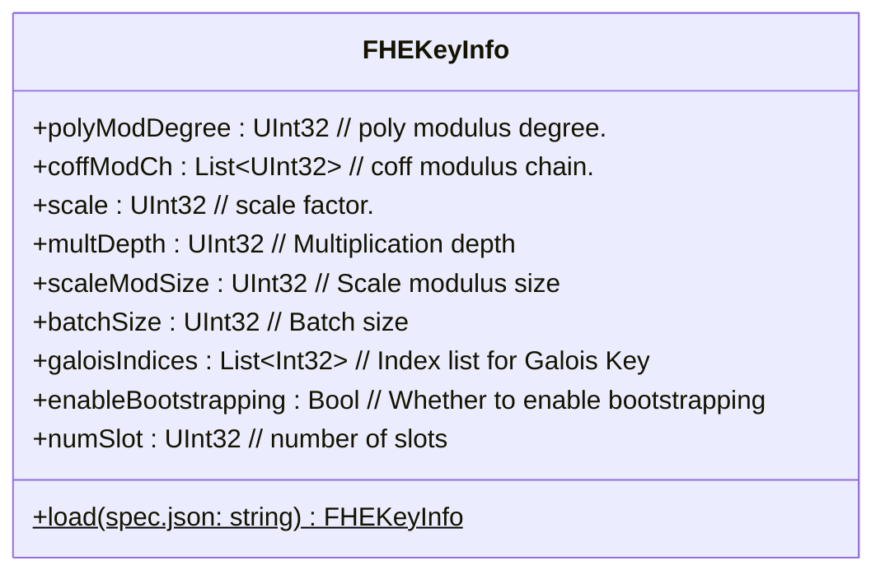
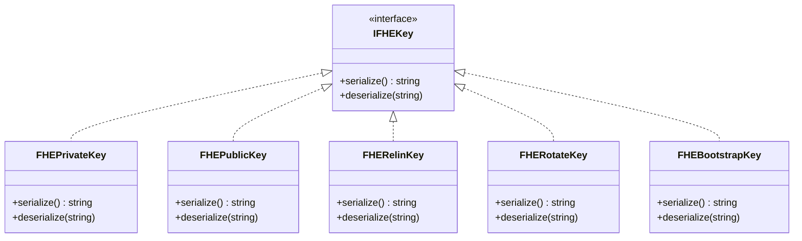
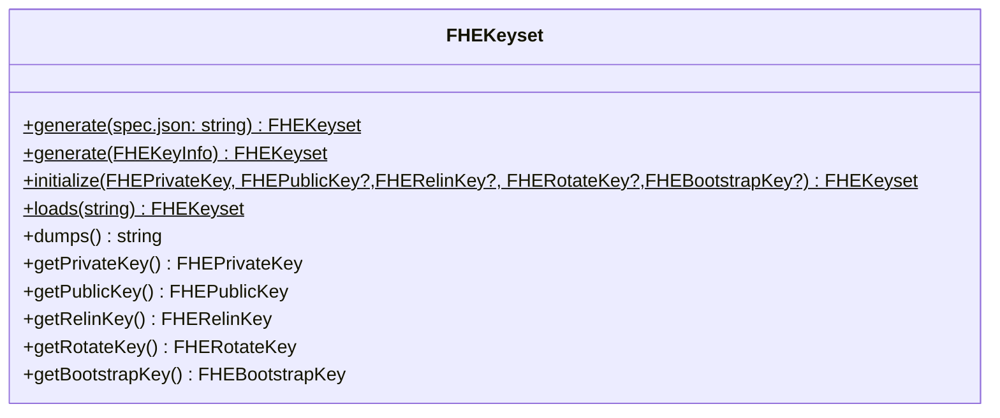
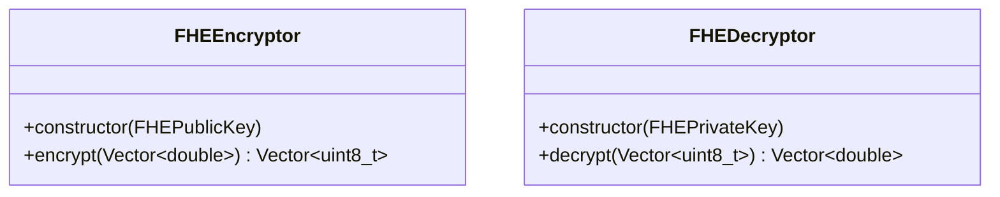
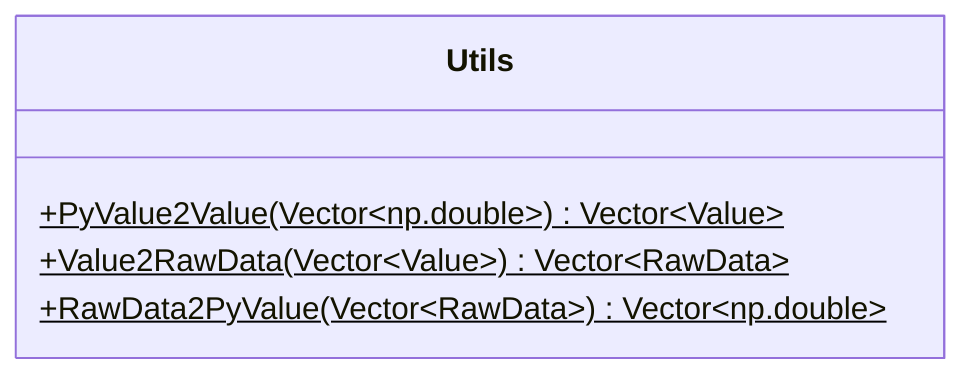
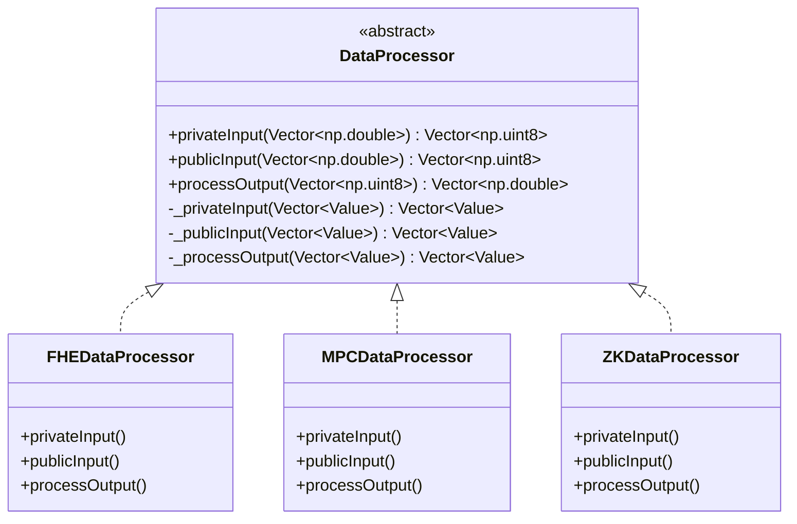
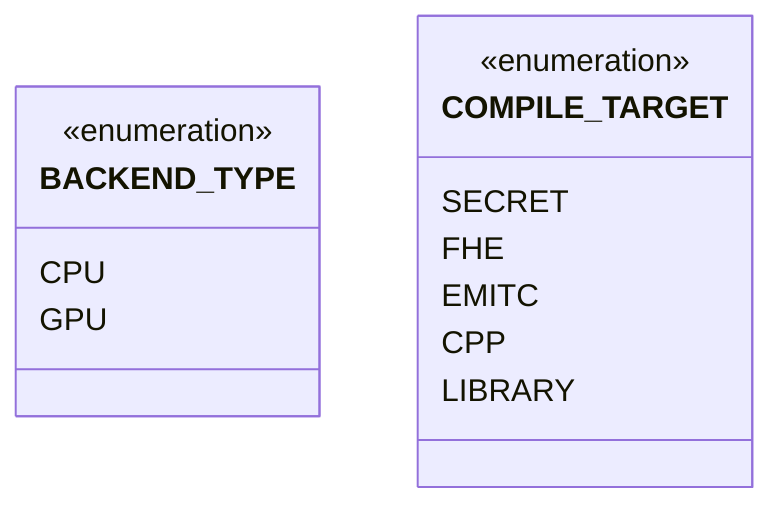
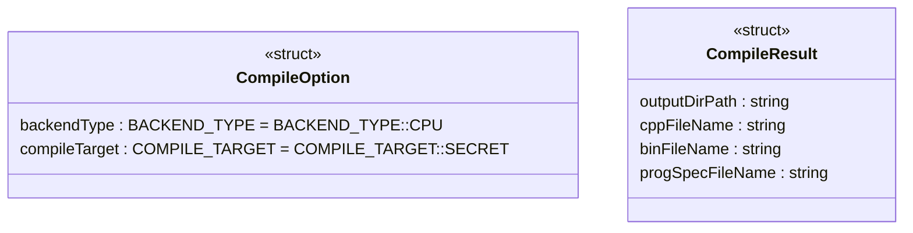
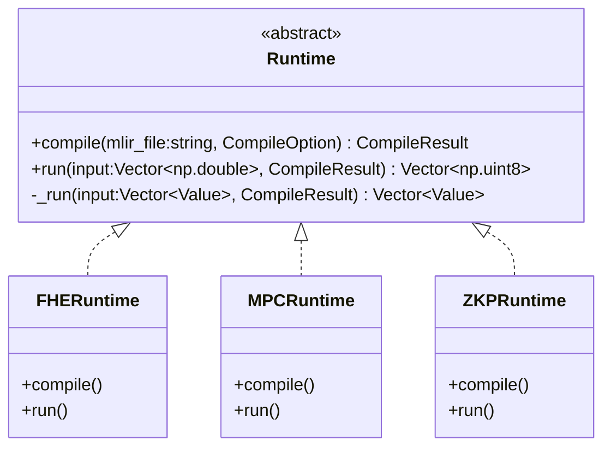

- [Overview](#overview)
- [FHEKey](#fhekey)
  - [FHEKeyInfo](#fhekeyinfo)
  - [FHEKeys](#fhekeys)
  - [FHEKeyset](#fhekeyset)
  - [FHEEncryptor/FHEDecryptor](#fheencryptorfhedecryptor)
  - [Simple Usage](#simple-usage)
- [DataProcessor](#dataprocessor)
  - [Simple Usage](#simple-usage-1)
- [Runtime](#runtime)
  - [Simple Usage](#simple-usage-2)


## Overview

- The module name is `primus.aegis_c`.
- The default backend is CPU. (Maybe add .gpu for GPU backend, such as` primus.aegis_c.gpu.XXX`.)
- The source folder is `./midend/lib/Binding`.
- The way how to import the module:
  ```py
  import primus.aegis_c
  ```

<br/>

Basic flow:
- Run `onnx-mlir` to compile the `onnx-model` to get the `model.mlir` file.
- Call `Runtime.compile(model.mlir)` to get the `program_spec.json` file.
- Call `FHEKeyInfo.load(program_spec.json)` to get the `FHEKeyInfo` object.
- Use `FHEKeyInfo` to generate the FHE Keys and so on.
- Call `Runtime.run(input)`.


## FHEKey

### FHEKeyInfo



The fields' value in the FHEKeyInfo structure come from the `program_sepc.json` file generated by `Runtime.compile()`, you should use `.load()` to construct the FHEKeyInfo object for now, in the near future it will be possible to manually populate the corresponding parameters as well.


### FHEKeys



Some keys related to FHE. The serialize/deserialize methods make it easy to save/load these keys.

### FHEKeyset


- You can use `.generate()` to generate a set of keys by passing in the spec.json file or by using FHEKeyInfo from the previous section.
- You can use `.get***Key()` to get the corresponding key.
- If you know the keys, you can also construct them via `.initialize()`, where the FHEPrivateKey is required.
- You can use `.dumps()` to save all the keys to a string, and then use `.loads()` to load the saved keys. (The implementation of dumps/loads at the binding level is optional and can be implemented at the python level. Need to discuss.)

(Need to think about the need to turn static methods into member methods. todo)


### FHEEncryptor/FHEDecryptor


Encrypting and decrypting using FHEEncryptor and FHEDecryptor. (Add a context to FHEEncryptor/FHEDecryptor?)

### Simple Usage

```py
from primus.aegis_c import FHEKeyInfo, FHEKeyset, FHEEncryptor, FHEDecryptor

# create FHEKeyInfo
fheKeyInfo = FHEKeyInfo.load(program_spec.json)

# generate keys
fheKeyset = FHEKeyset.generate(fheKeyInfo)
# or directly generate keys by
# fheKeyset = FHEKeyset.generate(program_spec.json)

# get one or some key(s) by FHEKeyset.get***Key()
fhePrivateKey = fheKeyset.getPrivateKey()
fhePublicKey = fheKeyset.getPublicKey()

# encrypt
plainData = <np.double>
encryptor = FHEEncryptor(fhePublicKey)
encryptedData = encryptor.encypt(plainData)

# decrypt
decryptor = FHEDecryptor(fhePrivateKey)
decryptedData = decryptor.decypt(encryptedData)
```

TODO: It would be better to use the `primus.aegis_c.fhe.XXX` namespace.

## DataProcessor




The `Utils` is the internal toolkit only used in binding level.
The data-type flow of the DataProcessor:
- Before privateInput: `numpy(double) -> Tensor(double) -> Value(double)`
- At privateInput: `Value(double) -> Tensor(double) -> encrypt() --> Tensor(uint8_t) -> Value(uint8_t)`
- At processOutput: `Value(uint8_t) -> Tensor(uint8_t) -> decrypt() --> Tensor(double) -> Value(double)`

### Simple Usage

```py
from primus.aegis_c import FHEDataProcessor

plainInputData = <np.double>

fheFHEDataProcessor = FHEDataProcessor()
privateData = fheFHEDataProcessor.privateInput(plainInputData)
```

## Runtime








- The `mlir_file`, the first parameter of `.compile()`, is generated by `onnx-mlir` after compiling the `onnx-model`.
- The `CompileResult.progSpecFileName` is the input to `KeyInfo.load()`.

### Simple Usage

```py
from primus.aegis_c import CompileOption, FHERuntime, ...

mlir_file = "/path/to/xxx.mlir"
compile_option = CompileOption()

fheRuntime = FHERuntime()

# compile
compile_result = fheRuntime.compile(mlir_file, compile_option)
# construct KeyInfo by `KeyInfo.load(compile_result.progSpecFileName)`

# run (should also pass some keys info??)
plainInputData = <np.double>
run_result = fheRuntime.run(inputData, compile_result)

# get the plain result (?)
fheFHEDataProcessor = FHEDataProcessor()
plain_result = fheFHEDataProcessor.processOutput(run_result)
```

