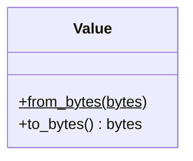
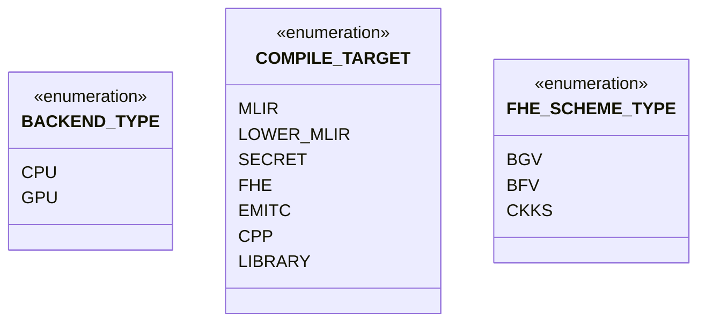
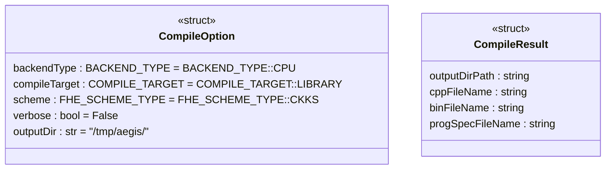
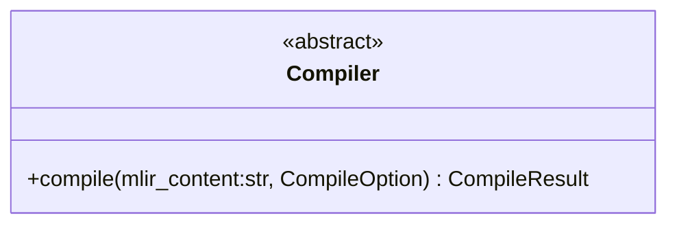
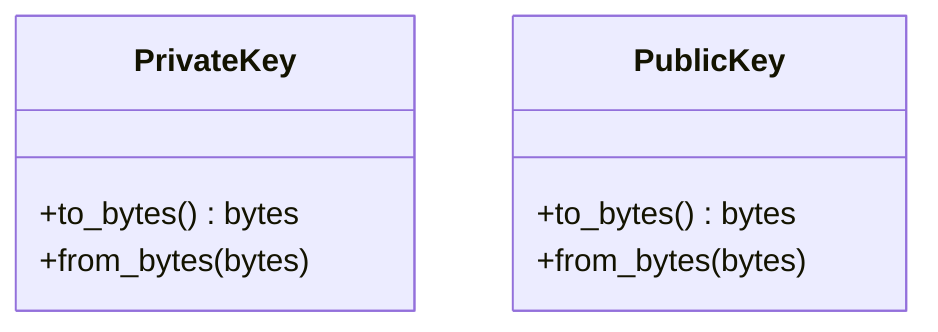
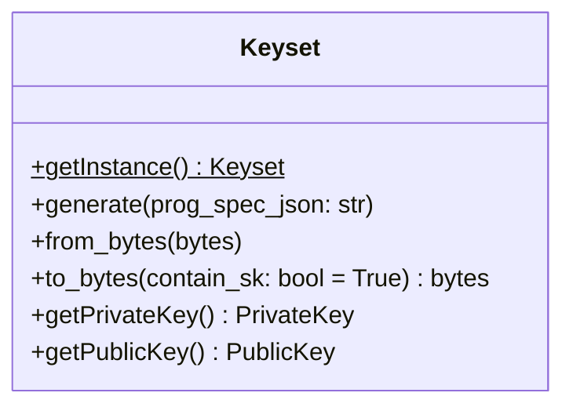
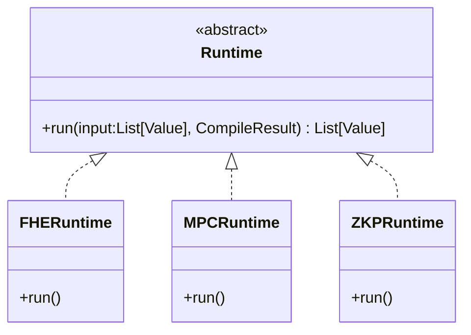

- [Overview](#overview)
- [Type](#type)
- [Compiler](#compiler)
- [FHE](#fhe)
- [FHE.DataProcessor](#fhedataprocessor)
- [FHE.Runtime](#fheruntime)
- [Usages](#usages)


## Overview

- The module name is `primus_aegis`.
- The default backend is CPU. (Maybe add .gpu for GPU backend, such as` primus_aegis.gpu.XXX`.)
- The source folder is `./midend/lib/Binding`.
- The way how to import the module:
  ```py
  import primus_aegis
  ```

<br/>

Basic flow:
- Run `onnx-mlir` to compile the `onnx-model` to generate the `model.mlir` content.
- Call `Compiler.compile(model.mlir)` to generate the `program_spec.json` etc..
- Call `FHEKeyset.generate(program_spec.json)` to generate the FHE keys and context.
- Call `FHERuntime.run(input,)` and so on.


## Type

Namespace: `primus_aegis`.



## Compiler

Namespace: `primus_aegis.compiler`.







- The `mlir_content`, the first parameter of `.compile()`, is generated by `onnx-mlir` after compiling the `onnx-model`.


## FHE

Namespace: `primus_aegis.fhe`.

**Keys**



Some keys related to FHE.

**Keyset**




- Use `.getInstance()` to get the instance of Keyset.
- Use `.generate()` to generate a set of keys (and context) by passing in the `prog_spec.json` file path.
- Use `.get***Key()` to get the corresponding key.
- Use `.to_bytes()` to save all the keys to a string, and then use `.from_bytes()` to load the saved keys. Only publicly available information will be exported if set `contain_sk` to `False`.


## FHE.DataProcessor

Namespace: `primus_aegis.dataprocessor` for FHEDataProcessor.


Use `privateInput/processOutput` for `encrypt/decrypt`.


## FHE.Runtime

Namespace: `primus_aegis.runtime` for FHERuntime.



- The `input` corresponds to `funcsInfo.functions[0].inputs` in the `prog_spec.json` file.
- The return value corresponds to `funcsInfo.functions[0].outputs` in the `prog_spec.json` file.


## Usages

- [compile mlir](../../midend/lib/Binding/test_1_compile.py)
- [generate and store keys](../../midend/lib/Binding/test_2_generate_key.py)
- [load keys, input/encrypt, store value](../../midend/lib/Binding/test_3_input.py)
- [load value, run](../../midend/lib/Binding/test_4_runtime.py)
- [output/decrypt](../../midend/lib/Binding/test_5_output.py)

