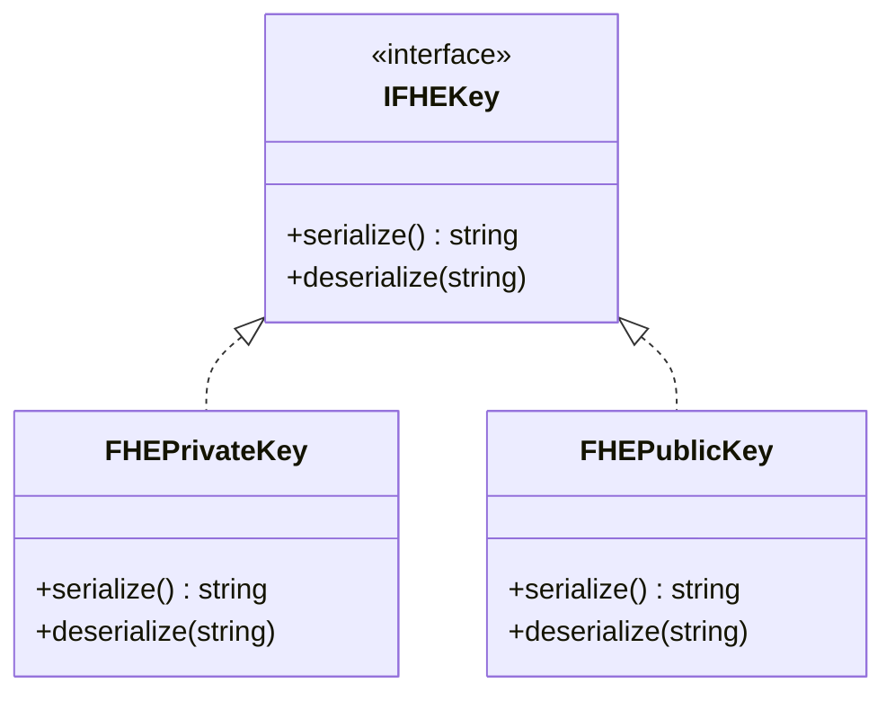
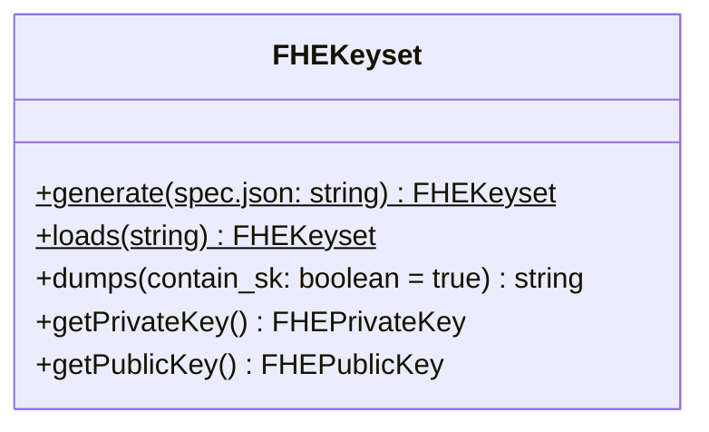
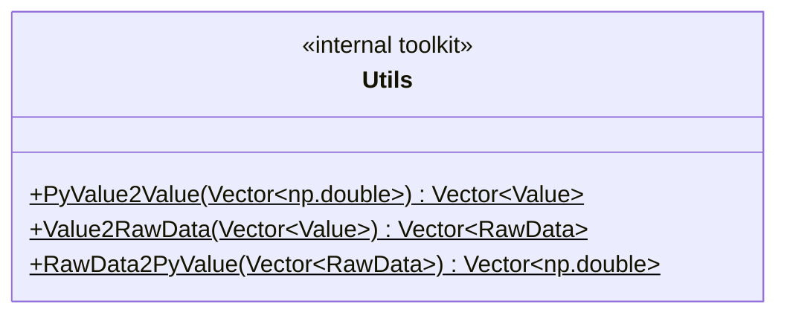
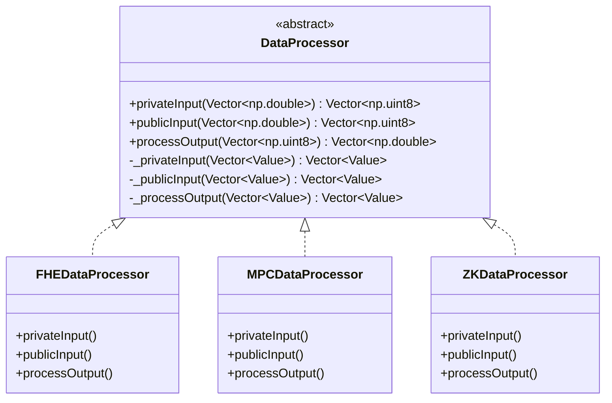
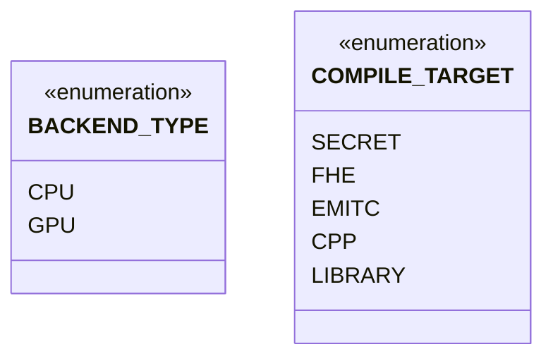
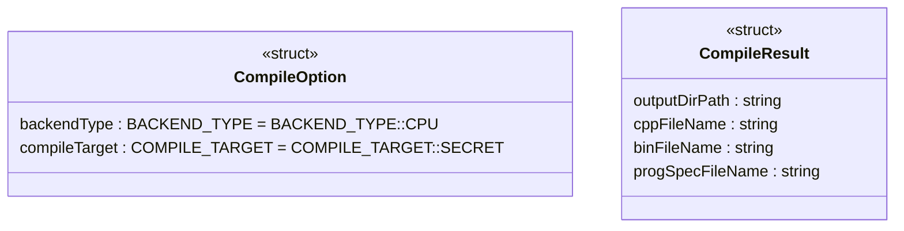
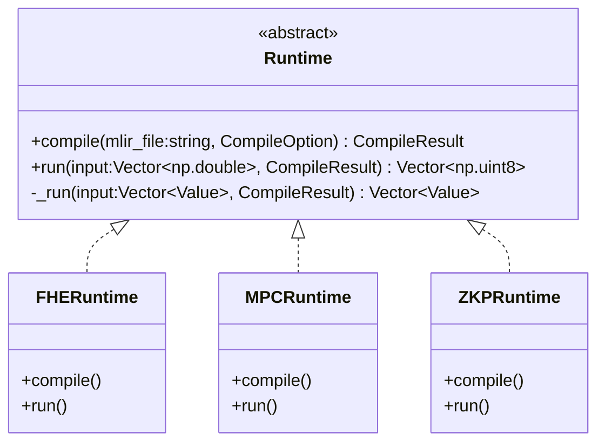

- [Overview](#overview)
- [FHE](#fhe)
  - [Simple Usage](#simple-usage)
- [DataProcessor](#dataprocessor)
  - [Simple Usage](#simple-usage-1)
- [Runtime](#runtime)
  - [Simple Usage](#simple-usage-2)


## Overview

- The module name is `primus.aegis_c`.
- The default backend is CPU. (Maybe add .gpu for GPU backend, such as` primus.aegis_c.gpu.XXX`.)
- The source folder is `./midend/lib/Binding`.
- The way how to import the module:
  ```py
  import primus.aegis_c
  ```

<br/>

Basic flow:
- Run `onnx-mlir` to compile the `onnx-model` to generate the `model.mlir` file.
- Call `Runtime.compile(model.mlir)` to generate the `program_spec.json` file.
- Call `FHEKeyset.generate(program_spec.json)` to generate the FHE keys and context.
- Call `Runtime.run(input)` and so on.


## FHE

**FHEKeys**



Some keys related to FHE. The serialize/deserialize methods make it easy to save/load these keys.

**FHEKeyset**




- Use `.generate()` to generate a set of keys (and context) by passing in the `program_sepc.json` file.
- Use `.get***Key()` to get the corresponding key.
- Use `.dumps()` to save all the keys to a string, and then use `.loads()` to load the saved keys. Only publicly available information will be exported if set `contain_sk` to `false`.


### Simple Usage

```py
from primus.aegis_c import FHEKeyset

# generate keys
fheKeyset = FHEKeyset.generate(program_spec.json)

# serialize all keys(and context) to a string
all_keys = fheKeyset.dumps()

# also can only dump publicly information by setting `contain_sk` to false.
# and send to compute node
publicly_keys = fheKeyset.dumps(false)

# load the keys
fheKeyset = FHEKeyset.loads(all_keys)
# or in the compute node
fheKeyset = FHEKeyset.loads(publicly_keys)


# you can only export private key or public key
fhePrivateKey = fheKeyset.getPrivateKey()
fhePublicKey = fheKeyset.getPublicKey()
private_key = fhePrivateKey.serialize()
public_key = fhePublicKey.serialize()
```


## DataProcessor




The `Utils` is the internal toolkit only used in binding level.
The data-type flow of the DataProcessor:
- Before privateInput: `numpy(double) -> Tensor(double) -> Value(double)`
- At privateInput: `Value(double) -> Tensor(double) -> encrypt() --> Tensor(uint8_t) -> Value(uint8_t)`
- At processOutput: `Value(uint8_t) -> Tensor(uint8_t) -> decrypt() --> Tensor(double) -> Value(double)`

### Simple Usage

```py
from primus.aegis_c import FHEDataProcessor

plainInputData = <np.double>

fheFHEDataProcessor = FHEDataProcessor()
privateData = fheFHEDataProcessor.privateInput(plainInputData)
```

## Runtime








- The `mlir_file`, the first parameter of `.compile()`, is generated by `onnx-mlir` after compiling the `onnx-model`.
- The `CompileResult.progSpecFileName` is the input to `Keyset.generate()`.

### Simple Usage

```py
from primus.aegis_c import CompileOption, FHERuntime, ...

mlir_file = "/path/to/xxx.mlir"
compile_option = CompileOption()

fheRuntime = FHERuntime()

# compile
compile_result = fheRuntime.compile(mlir_file, compile_option)
# construct Keyset by `Keyset.generate(compile_result.progSpecFileName)`

# run
plainInputData = <np.double>
run_result = fheRuntime.run(inputData, compile_result)

# get the plain result
fheFHEDataProcessor = FHEDataProcessor()
plain_result = fheFHEDataProcessor.processOutput(run_result)
```

