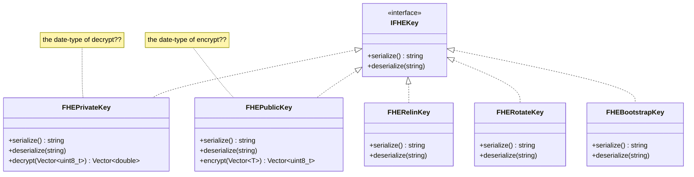
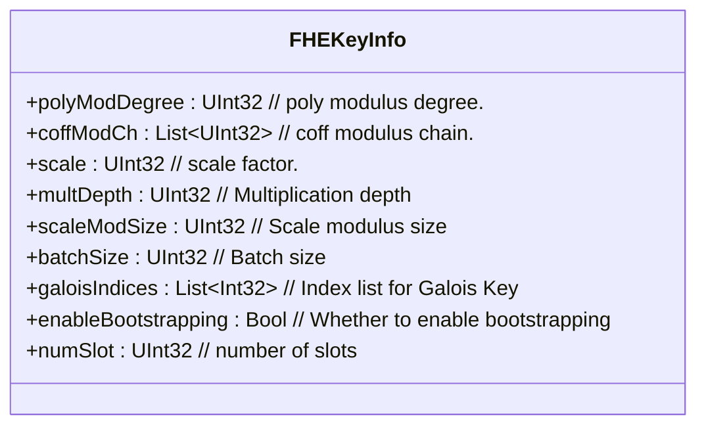
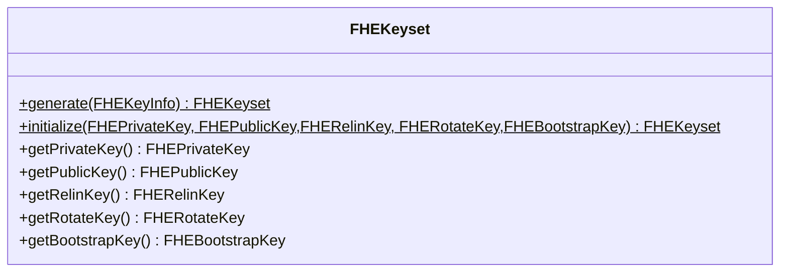
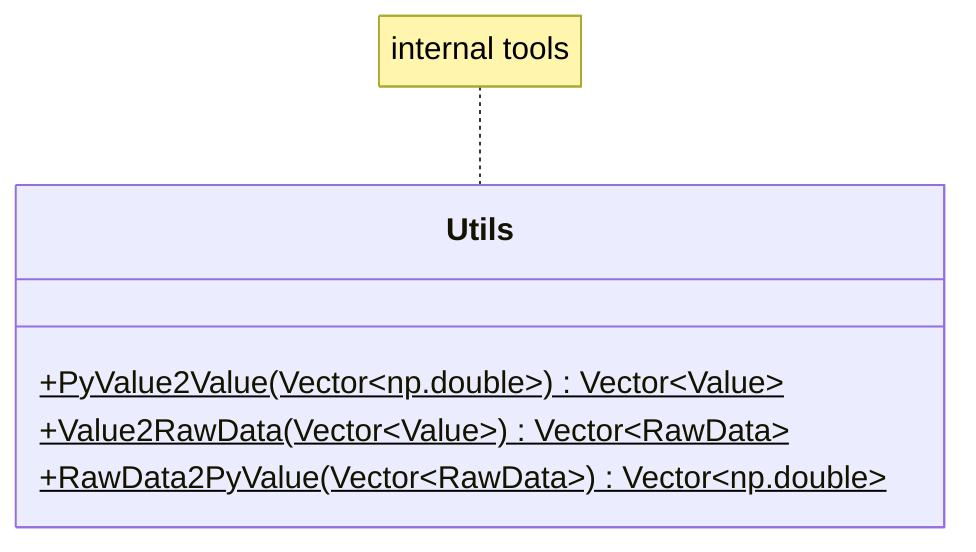
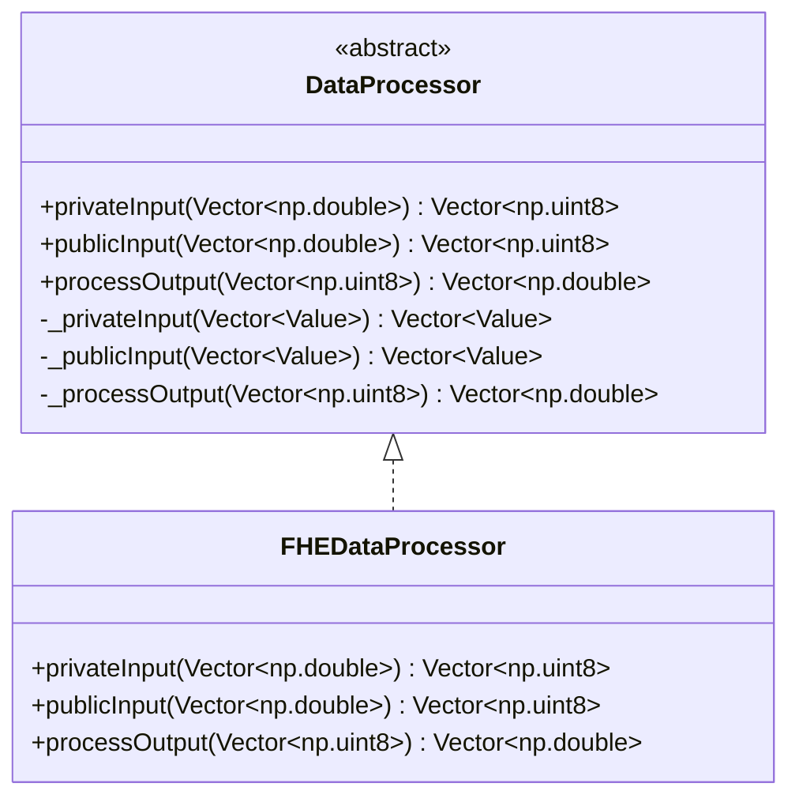
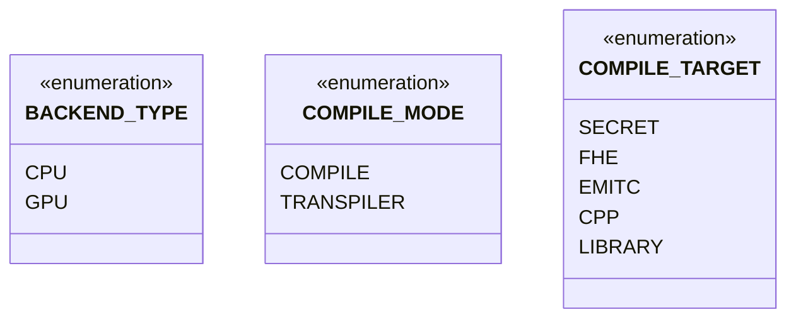
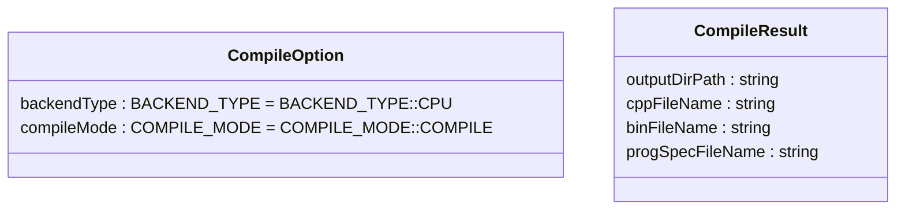
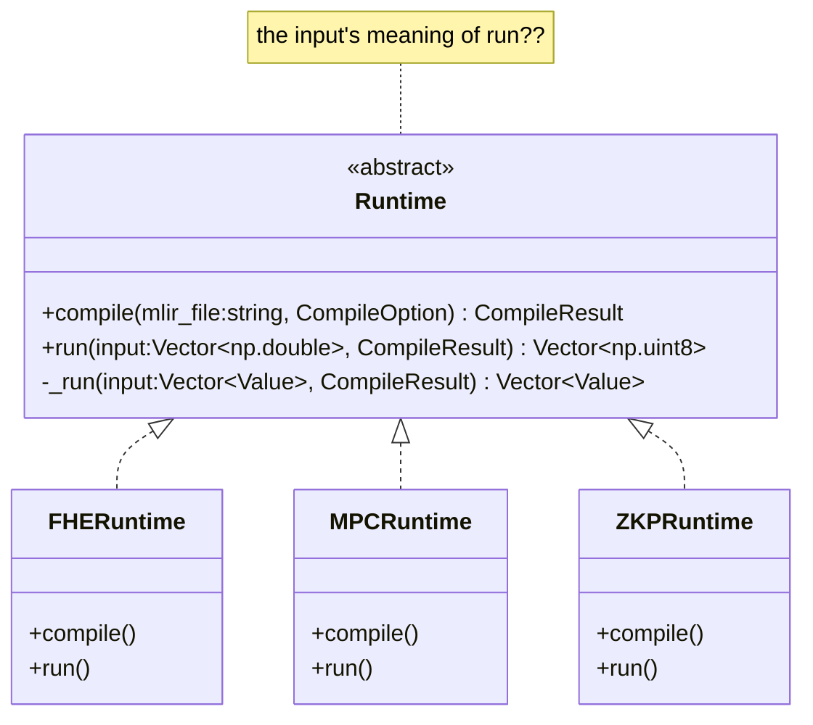

## Modules

- The module name is `primus.aegis_c`.
- The default backend is CPU. (Maybe add .gpu for GPU backend, such as` primus.aegis_c.gpu.XXX`.)
- The source folder is `./frontend/cc`.
- The way how to import the module:
  ```py
  import primus.aegis_c
  ```


### FHEKey








**Simple usage:** (expected)

```py
from primus.aegis_c import FHEKeyInfo, FHEKeyset, ...

# set the parameters of FHEKeyInfo
fheKeyInfo = FHEKeyInfo()
fheKeyInfo.xxx = yyy

# generate keys
fheKeyset = FHEKeyset.generate(fheKeyInfo)

# get one or some key(s) by FHEKeyset.getXXXKey()
fhePrivateKey = fheKeyset.getPrivateKey()
fhePublicKey = fheKeyset.getPublicKey()

# do some operations
plainData = ...
encryptedData = fhePublicKey.encypt(plainData)
decryptedData = fhePrivateKey.decypt(encryptedData)
```

### DataProcessor





- Before privateInput: `numpy(double) -> Tensor(double) -> Value(double)`
- At privateInput: `Value(double) -> Tensor(double) -> encrypt() --> Tensor(uint8_t) -> Value(uint8_t)`
- At processOutput: `Value(uint8_t) -> Tensor(uint8_t) -> decrypt() --> Tensor(double) -> Value(double)`


**Simple usage:** (expected)

```py
from primus.aegis_c import FHEDataProcessor

plainInputData = numpy<np.double>

fheFHEDataProcessor = FHEDataProcessor()
privateData = fheFHEDataProcessor.privateInput(plainInputData)

```

### Runtime










**Simple usage:** (expected)

```py
from primus.aegis_c import CompileOption, FHERuntime, ...

mlir_file = "/path/to/xxx.mlir"
compile_option = CompileOption()

fheRuntime = FHERuntime()

# compile
compile_result = fheRuntime.compile(mlir_file, compile_option)

# run
inputData = ...
run_result = fheRuntime.run(inputData, compile_result)
# what's inputData?? run_result??
```
